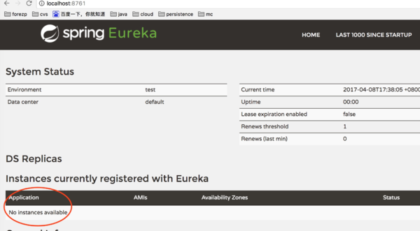
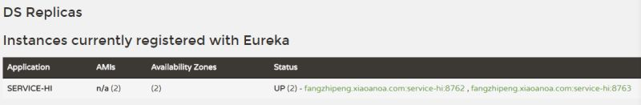

# SpringCloud
Project using SpringCloud to monitor

Group Member
张伯宁 516030910319
李凌荟 516030910372
陈志扬 516030910347
余心如 516030910128
___

案例全部采用Spring Boot 1.5.x 
Spring Cloud版本为Dalston.RELEASE

spring cloud 简介：
为开发人员提供了快速构建分布式系统的一些工具，包括配置管理、服务发现、断路器、路由、微代理、事件总线、全局锁、决策竞选、分布式会话等等。
运行环境简单，可以在开发人员的电脑上跑。且spring cloud基于springboot
___

服务的注册与发现（Eureka）
1. 创建服务注册中心
需要使用组件Spring Cloud Netflix的Eureka 
Eureka是一个服务注册和发现模块。
Eureka是一个高可用的组件，没有后端缓存，每一个实例注册之后需要向注册中心发送心跳（因此可以在内存中完成），在默认情况下erureka server也是一个eureka client 
必须要在eureka server的配置文件appication.yml显式指定一个 server。
___

___

2. 创建Client
当client向server注册时，它会提供一些元数据，例如主机和端口，URL，主页等。Eureka server 从每个client实例接收心跳消息。 如果心跳超时，则通常将该实例从注册server中删除。
通过注解@EnableEurekaClient 表明自己是一个eurekaclient.
还需要在配置文件中注明自己的服务注册中心的地址
___

___

一、ribbon简介

    Ribbon is a client side load balancer which gives you a lot of control over the behaviour of HTTP and TCP clients. Feign already uses Ribbon, so if you are using @FeignClient then this section also applies.

    —–摘自官网

ribbon是一个负载均衡客户端，可以很好的控制htt和tcp的一些行为。Feign默认集成了ribbon。

ribbon 已经默认实现了这些配置bean：

    IClientConfig ribbonClientConfig: DefaultClientConfigImpl

    IRule ribbonRule: ZoneAvoidanceRule

    IPing ribbonPing: NoOpPing

    ServerList ribbonServerList: ConfigurationBasedServerList

    ServerListFilter ribbonServerListFilter: ZonePreferenceServerListFilter

    ILoadBalancer ribbonLoadBalancer: ZoneAwareLoadBalancer
___

    一个服务注册中心，eureka server,端口为8761
    service-hi工程跑了两个实例，端口分别为8762,8763
    分别向服务注册中心注册
    sercvice-ribbon端口为8764,向服务注册中心注册
    当sercvice-ribbon通过restTemplate调用service-hi的hi接口时
    因为用ribbon进行了负载均衡
    会轮流的调用service-hi：8762和8763两个端口的hi接口；
___
Thanks!

